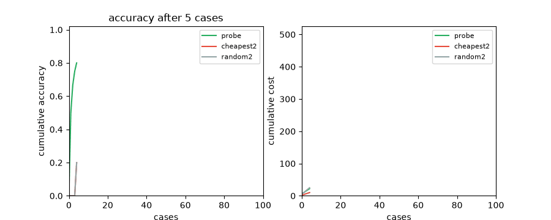

# PFN Probe — measure only what matters

> **Why this matters (20s):** Every medical test or survey question costs
> money. Probe asks TabPFN what each unmeasured feature is worth *before*
> measuring it, orders the best deal, and STOPs when nothing is worth the
> price — 0.83 accuracy at 3.81 cost vs 0.57 at 5.00 for fixed random-2,
> winning loss+0.05·cost 0.361 vs 0.680.



Sequential feature acquisition with a STOP action. A case arrives partial;
every unmeasured feature has a cost. TabPFN-3.5 predicts natively on partial
rows; plausible outcomes come from hot-deck conditional sampling (nearest
context neighbors on observed features — no fits, calibrated spread; an
earlier TabPFN-imputation simulator proved overdispersed and was cut).
VOI(j) = risk now − expected risk after measuring j − λ·cost(j).
Order while max VOI > 0, else STOP. No learned acquisition policy.

```python
pb = Prober(Xctx, yctx, costs, cat_cols=[...])
j, p, vois = pb.step(partial_row, known)  # j=None means STOP
```

Costs in this repo are illustrative (S6E9 survey/income-verification story).

## Results (`figs/probe.csv`, 100 cases, S6E9)

| strategy | accuracy | avg cost | avg tests | loss+cost | loss+0.05·cost |
|---|---|---|---|---|---|
| cheapest-2 (fixed) | 0.17 | 2.00 | 2.0 | 2.83 | 0.930 |
| random-2 (fixed) | 0.57 | 5.00 | 2.0 | 5.43 | 0.680 |
| **PFN Probe** | **0.83** | **3.81** | **2.0** | **3.98** | **0.361** |

Probe wins the policy-consistent loss + 0.05·cost objective (0.361 vs 0.680
vs 0.930) while achieving substantially higher accuracy than either fixed-2
baseline. On raw loss+cost cheapest-2 wins (2.83), but at 0.17 accuracy — the
weighted objective is the policy decision rule. Fixed-2 baselines show the
policy matters, not just the budget: cheapest-2 collapses to 0.17 accuracy.

## Reproduce

Fresh-env verified 2026-09-22 (clean venv, `pip install -e .`, Probe VOI suite 1 passed in 17s CPU; TabPFN weights from public HF, no keys).

```bash
pip install -e .   # Python 3.10+, torch, tabpfn==9.0.0
# S6E9 data:
kaggle competitions download -c playground-series-s6e9 -p data && unzip -o data/*.zip -d data/
<venv-python> -m pytest tests/ -q
<venv-python> experiments/run.py   # figs/probe.csv
<venv-python> demo/app.py          # case player (port 5004)
```
